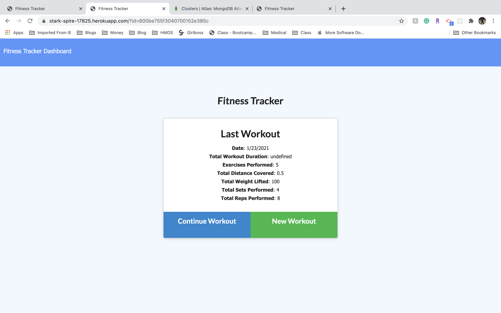
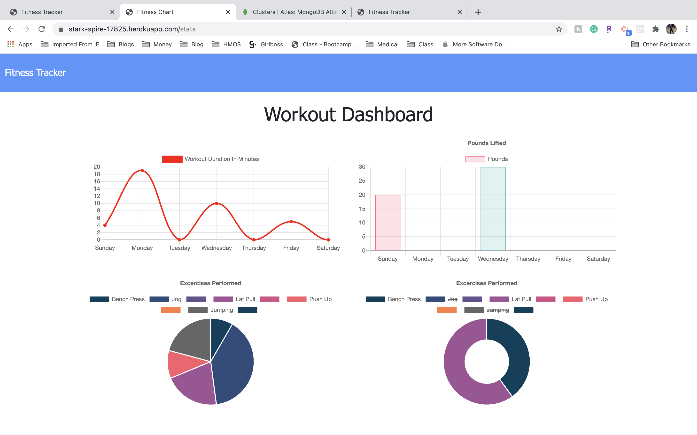

# 17 Fitness Tracker

The fitness tracker is a no SQL app that uses MongoDB to hold information about a user's workouts. Users can enter resistance and cardio workouts, pick up on their last workout, or view stats on all previous workouts.

## Table of Contents
* [Installation](#Installation)
* [Usage](#Usage)
* [Screenshots](#Screenshots)
* [License](#License)
* [Contributing](#Contributing)
* [Tests](#Tests)
* [Questions](#Questions)

## Installation
npm i

## Usage
Once the app is opened, if there are no prior workouts, you will see a button that says "New Workout." Users will click on that button and follow the inputs on how to enter their workout. After each entry, users will click to add an exercise or to complete the workout. On the homescreen, you will see a workout summary. If you click "Dashboard" in the navigation, you will be able to view stats for all workouts.

#### Repository: 
https://github.com/KayleeHorner/17_fitness_tracker

#### Deployed App:
https://stark-spire-17825.herokuapp.com/?id=600be755f3040700152e385c

## Screenshots

## License
This project is licensed under the MIT license.

## Contributing
No

## Tests
N/A

## Questions
If you have any questions, you can find me on Github under at http://github.com/kayleehorner. Still have questions? You can email me at: kayleeahorner@gmail.com
